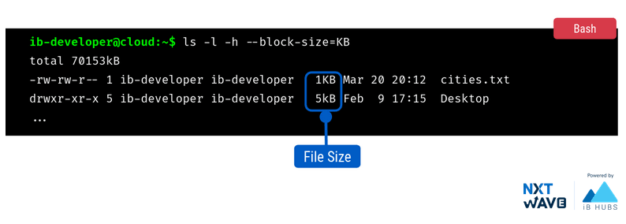
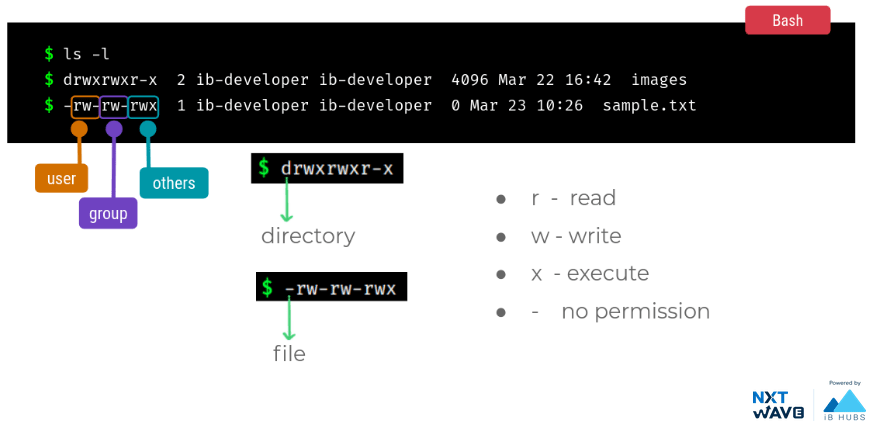

# Command-line

<!-- # Command Line Interface
- Command Line Interface (CLI) facilitates the users to perform powerful operations on a computer with simple commands.
- Command is a text instruction to a computer program to perform a specific task.

## What is Shell?
- Shell is the  software that interprets and executes the various commands that we provide.
- Terminal is a text input/output environment.
### Different Shells
- Bourne Shell (sh)
- Bourne-Again Shell (bash)
- C Shell (csh)
- Korn Shell (ksh)
- Z Shell (zsh)
## Opening Terminal
Bash is one of the most commonly used shell in Linux distributions.
- Open the Dash (Super Key) or Applications and type terminal.
- Shortcut: ``Ctrl + Alt + T`` -->


## Listing Files & Directories
`ls` &nbsp;  is used to list files and directories.
```bash
ls
```
### Using Additional Options
- `ls -l -h` option provides details in human readable format.

- Some options require values arguments/values to be passed.
    - `--block-size` &nbsp; option rounds the file size to nearest values.
    - Inputs: &nbsp;`KB , MB`

## Get Options for Commands
`help` &nbsp; displays a list of options that you can use with the command. 
```bash
ls --help
```   
This Command will be helpful when you don’t know about its parameters and return type etc.
## Clear the Screen
- `clear` &nbsp; command clears the terminal.
- Shortcut: &nbsp; `Ctrl+L`
```bash
clear
```
## Get User Manual for Commands
- `man` &nbsp; displays the user manual of a command .
- Here we pass the command as an argument.
#### *syntax* : 
```bash
man <command>
```
#### example :
```bash
man ls
```
- Type &nbsp; `q` &nbsp; to exit the manual
## Get System Date & Time 
`date` &nbsp; displays the system date and time.
```bash
date
```
## Get Current User
`whoami` &nbsp; displays the current logged in user
```bash
whoami
```
## Previous Commands
- Shell keeps track of the commands you have typed in.
- Use up ( ⬆) and down ( ⬇) arrows to access the commands.
## History
- `history` &nbsp; displays the history of the commands you have typed in so far.
- By default, It shows the last 500 recent commands.
```bash
history
```
## Bash History
Bash maintains the history to *. bash_history* file.
```bash
cat .bash_history
```
## Exit
`exit` &nbsp; to close/end a shell session.
```bash
exit
```
# Summary :

----------------------------------------------------------------

# Working With Files
## Creating a File
`touch` &nbsp;  creates an empty file.
```bash
touch filename
```
## Viewing File Content
`cat` &nbsp; eads contents of file and prints it.
```bash
cat filename
```
## Echo
`echo` &nbsp; output/prints a string in the terminal.
```bash
echo "content"
```
## Writing to Files Using echo Command
Using > (greater than) operator we can redirect the output of echo command to a file.
```bash
echo "Hello World!" > filename
```
## Renaming a File
-`mv` &nbsp; renames the file names.
- *destination* can be a new or existing file.
#### *syntax* :
```bash
mv source destination
```
#### Example :
```bash
mv practice.txt exam.txt
```
## Copying Files
`cp` &nbsp; copies src_file to dest_file.
#### *syntax* :
```bash
cp src_file dest_file
```
#### Example :
```bash
cp exam.txt fun_text.txt
```
**Note :** If dest_file already exist then &nbsp; `cp` &nbsp; overrides the contents of dest_file.
## Deleting a File
`rm` &nbsp; removes (delete) files.
#### *syntax* :
```bash
rm filename
```
#### example :
```bash
rm exam.txt
```
## Hidden Files
- Linux, by default, hides many of the sensitive system files, in order to avoid accidental changes.
- Hidden files starts with "."
- `ls a` &nbsp; shows the hidden files.
- `ls a` &nbsp; also shows the current and parent directories:
    - `.` represents `Current directory`
    - `..` represents `parent directory`
```bash
ls -a
```
# Summary:

----------------------------------------------------------------

# Working with Directories
## Creating A Directory
`mkdir` &nbsp;  creates a directory.
```bash
mkdir directory_path
```
## Current Working Directory
`pwd` &nbsp;  prints name of current working directory.


## Changing the Current Working Directory
`cd` &nbsp; changes the current working directory.
```bash
cd directory_path
```
**Note :** `cd /` &nbsp;  changes your current directory to root folder.

## Creating a Directory in Directory
`mkdir` &nbsp; creates a directory.
```bash
mkdir directory_name
```
## Switching to Parent Directory
- `cd ..` &nbsp; move to parent directory.
-  Here &nbsp; `..` &nbsp; is relative path to parent directory.
```bash
cd ..
```
# File Paths
There are two notations for  file paths: 
1. Absolute Path
2. Relative Path

## Absolute Path:
Representing the complete path of a file or folder from the root.

## Relative Path:
Representing the path of a file or folder  wrt.  current working directory.

In relative path conventions:
- `.` &nbsp; refers to the current working directory.
- `..` &nbsp; refers to the parent directory.

## Home Directory
Each user in the computer is given a separate directory to work with - called home directory.
- `cd ~`&nbsp; can be used to switch to home directory.
```bash
cd ~
```
- `cd ` &nbsp; (cd and space) command can also be used to switch to home directory.
```bash
cd 
```
## Renaming a directory
`mv` &nbsp; renames the directory name
#### *syntax :*
```bash
mv source destination
```
#### *example :*
```bash
mv tutorial commands
```
## Moving a directory
`mv` &nbsp; moves files or directories  from source to destination paths.
#### *syntax :*
```bash
mv source destination
```
#### *example :*
```bash
mv welcome.txt commands
```
## Copying Files to Another Directory
`cp` &nbsp; can be used to copy files between directories.
#### *syntax :*
```bash
cp file_path directory_name
```
#### *example :*
```bash
cp welcome.txt commands
```
## Copying Directory
`cp -r` &nbsp; can be used to  copy a directory.
#### *syntax :*
```bash
cp -r source_path destination_path
```
#### *example :*
```bash
cp -r commands linux
```
## Common Mistake
Raises an error if destination path have any non existing directories in between.

## Deleting a Directory
`rm -r` &nbsp; removes(deletes) directories.
#### *syntax :*
```bash 
rm -r directory_name
```
#### *example :*
```bash
rm -r commands
```
# Summary 
We can use folder/file paths for cp, mv, rm commands.

----------------------------------------------------------------

# Working with Files
## Text Editor
- A text editor is used for editing text files.
- Various text editors are:
    - Notepad++
    - Sublime Text
    - gEdit
    - Visual Studio Code  etc..
## Nano
Nano is an easy to use command line text editor for Unix and Linux-based operating systems.

#### **Open file**
To open a file with nano, pass the filename as an argument.
```bash
nano filename
```
#### **Updating File**
Add the text of the file in the middle of the editor.

#### Saving File
To save a file, &nbsp; `PRESS  Ctrl+O` &nbsp; and &nbsp; `Enter()`
#### Exit Nano
To exit from nano editor,  &nbsp; `PRESS  Ctrl+X`
#### Viewing File Contents
To view file Contents:
```bash
cat filename
```
# Filtering & Output Redirection
## Filtering
We can filter the contents of a file using the following filter commands.
- head
- tail
- grep
### head
- Used to print top N lines of a file.
- By default, it will print the first 10 lines.
#### *syntax* :
```bash
head [-N] filename
```
#### example : 
```bash
head -2 sentences.txt
```
### tail
- Used to print last N lines of a file.
- By default it will print the last 10 lines.
#### *syntax* : 
```bash 
tail [-N] filename
```
#### Example :
```bash
tail -2 sentences.txt
```
# Counting
## Word Count
`wc` &nbsp;  is used to find out number of lines, word count and characters  count in the files.
#### *syntax* :
```bash
wc filename
```
#### example :

## piping
- Pipe is used to combine two or more commands
- Output of one command is passed as an input to the command followed and so on.
### Using ‘ | ’
#### *syntax* :
```bash
command_1 | command_2 | command N 
```
#### example :
```bash
cat sentences.txt | head -2
```
### Grep 
Searches a file or files for lines that have a certain pattern.
#### *syntax* :
```bash
cat filename | grep <pattern>
```
#### example :
```bash
cat sentences.txt | grep "morning"
```
### Example 1
Number of lines that contain the word morning in the given file.

### Example 2
Occurrences of the word "morning" in the given file from the lines 10 to 15

## Output Redirection
**">"** takes the standard output of the command and redirects it to the file.
#### *syntax* :
```bash
command > filename
```
#### example :
```bash
cat sentences.txt | head -2 > learnings.txt
```
# Compressing & Uncompressing Files
- File compression is a reduction in the number of bits needed to store the data of a file.
- Files are stored in such a way that, it uses less disk space than all the individual files and directories combined
- Advantages of compressing files are:
    - taking less disk space
    - easier and faster transmission
- Commonly used file formats for the compressed files:
    - gzip
    - zip
    - tar

### tar
We can use tar to compress files & directories
## Compression
#### *syntax* :
```bash
tar -czvf file-name.tar.gz path1 path2 ..
```
### example :
```bash
tar -czvf my_collection.tar.gz videos report.txt
```
## Extract/ Uncompress
#### *syntax* :
```bash
tar -xzvf filename.tar.gz -C path
```
#### example :
```bash
tar -xzvf my_collection.tar.gz -C collections
```
## Zip
It is used to package all the files into one file with .zip extension
#### *syntax* :
```bash
zip -r zipfile.zip file1 folder1 file2 ...
```
#### example :
```bash
zip -r collections.zip videos report.txt
```
## Unzip
The unzip command extracts all files from the specified ZIP archive
#### *syntax* :
```bash
unzip filename.zip -d path
```
### example :
```bash
unzip collections.zip -d new-folder
```
# Summary

----------------------------------------------------------------
# Super User & File Permissions
## Linux Users
The **root user**, also known as the **superuser** or **administrator**, has access to all commands and files.
## Root User
`sudo` &nbsp;  command temporarily elevates the privileges allowing users to complete sensitive tasks without logging in as the root user.
```bash
sudo command
```
# Linux Commands
## Executable Path
`which` &nbsp;command is used to identify the location of a given executable path.
#### *syntax* :
```bash
which command
```
#### example :
```bash
$  which sudo
/usr/bin/sudo
```
## Create New Users
`useradd` &nbsp; is used to create a new user with the given username.
#### *syntax* :
```bash
sudo useradd username 
```
#### example :
```bash
sudo useradd ganu
```
## Set/Change User Password
`passwd` &nbsp; is used to set or change password of a given user.
#### *syntax* :
```bash
sudo passwd username
```
#### example :
```bash
sudo passwd ganu
```
## Execute Command as Another User
`su` &nbsp; is used to execute command as another user.
```bash
su user
```
```bash
su -c command user
```
# File Permissions
## Authorization Levels
Multi-user operating systems  like linux provide two levels of authorization in securing the files
- Ownership
- Permission
## User Ownership
Users accessing a file/ directory can be categorized into 3 types

## Ownership and Permissions

## File Permissions in Linux
 
## Changing Permissions
#### *syntax* :
```bash
chmod permissions filename
```
#### example :
```bash
chmod 764 sample.txt
```
**"chmod"** stands for change mode


## Changing Ownership
- For changing the user of a file/directory
#### *syntax* :
```bash
sudo chown user filename
```
#### example :
```bash
sudo chown root sample.txt
```
- For changing the user and group of a file/directory
#### *syntax* :
```bash
sudo chown user:group filename
```
#### example :
```bash
sudo chown root:root sample.txt
```
# Packaging
## Package & Repository
- A package file is a compressed collection of files that comprise the software package
- Packages are stored in repositories to make them accessible to users
# Package Managers
## apt
- APT stands for the Advanced Packaging Tool
- It is used to  install, upgrade or remove software packages  in linux
#### *syntax* :
```bash
sudo apt
```
### Installing Package
Installing a package from a repository
#### *syntax* :
```bash
sudo apt install package_name
```
## brew
- It is a Package Manager for macOS.
    - With &nbsp;`brew`&nbsp; command you can install the packages in macOS.
### Installing Package
#### *syntax* :
```bash
brew install package_name
```
### yum
`yum`&nbsp; is a graphical based package management tool for RPM (RedHat Package Manager)  based Linux systems.
### Installing Package
#### *syntax* :
```bash
yum package_name
```
# Downloading Files From Web
## wget
`wget` &nbsp; is a command-line utility for downloading files from the web.

To install &nbsp; `wget` &nbsp; :
- apt 
```bash
sudo apt install wget
```
- brew :
```bash
sudo brew install wget
```
- yum: 
```bash
sudo yum install wget
```
`wget`&nbsp; will download the resource specified in the url to the  current directory.
#### *syntax* :
```bash
wget "URL"
```
#### example :
```bash
wget "https://www.lifewire.com/uses-of-command-wget-2201085"
```
## curl
`curl` &nbsp; is a command-line utility for transferring data from or to a server designed to work without user interaction.

To instal &nbsp; `curl` :
- apt :
```bash
sudo apt install curl
``` 
- brew :
```bash
sudo brew install curl
``` 
- yum :
```bash
sudo yum install curl
``` 
`curl` &nbsp; prints the contents of the URL to the output.
#### *syntax* :
```bash
curl "URL"
```
#### example :
```bash
curl "wttr.in"
```
## Searching a Package
`apt-cache` &nbsp;  command is used to searches for a particular package.
#### *syntax* :
```bash
sudo apt-cache search package_name
```
#### example :
```bash
apt-cache search google
```
## Updating Packages
- System checks against the repositories.
- If newer version available of the program it will update the information about the existing packages and their versions available.
Updating a package from a repository:
### upgrade
`upgrade` &nbsp; will upgrade all the applications to latest version.
```bash
sudo apt upgrade
```
### update
`update` &nbsp; will simply update the information about the existing packages and their versions available
```bash
sudo apt update
```
## Listing Installed Packages
`dpkg -l` &nbsp; : It is used to list all installed packages
```bash
sudo dpkg -l
```
## Adding Repository
PPA (Personal Package Archive)  is an application repository that can be used to upgrade and install packages from third parties. &nbsp;
`add-apt-repository` &nbsp; : It is used to add repository
#### *syntax* :
```bash
sudo add-apt-repository repository_link
```
## Adding the Private PPA's security key
Your Linux device can use that signature to check the authenticity of the packages.
`apt-key` &nbsp; : Add PPA security key
#### *syntax* :
```bash
sudo apt-key add - KEY_ID
```
## Removing a Package
`remove` &nbsp; : removes the installed packages
#### *syntax* :
```bash
sudo apt remove package_name
```
# Summary 

**Warning**
Under the installation of an &nbsp; `apt` &nbsp; package from a PPA, there is a change in one of the MongoDB installation steps, due to the changes made by the MongoDB website. 

Update command from 
```bash
curl https://www.mongodb.org/static/pgp/server-4.4.asc  | sudo apt-key add -
```
to
```bash
curl https://pgp.mongodb.com/server-4.4.asc | sudo apt-key add -
```
for a seamless monogodb installation.

-----------------------------------------------------------
# Networking Commands
## Network Connectivity
`ping` &nbsp; checks the network connectivity between host and server/host.
#### *syntax :*
```bash
ping hostname/IP address
```
#### *example :*
```bash
ping google.com
```
## Route Path
`traceroute` &nbsp; prints the route that a packet takes to reach the host.
#### *syntax :*
```bash
traceroute host_address
```
#### *example :*
```bash
traceroute google.com
```
## Network Interface
A network interface is a software interface to networking hardware.

Different types of network interfaces are:
- Ethernet
- Loopback etc.
# Information About Network Interfaces
## ifconfig
`ifconfig` &nbsp; gives you the information of various network interfaces.
```bash
ifconfig
```

## Ethernet Interface
**exxxx** is a physical interface representing Ethernet network card.

## loopback interface
- **lo** is a special virtual network interface called loopback device.
- It is used to connect to services running on the user system

# Environment Setup
## Environment Variables
- Linux environment variables act as placeholders for information stored within the system.
- They will be available to the programs launched from the shell.
## Listing
`env` &nbsp;  command can be used to print all the environment variables.
```bash
env
```
## Creating & Updating
`export` &nbsp; command  is used to define/update value for a variable. 
#### *syntax :*
```bash
export VARIABLE_NAME=variable_value
```
#### *example :* 
```bash
export CUSTOM_ENV_VARIABLE=10
```
## Accessing Environment Variables
- Use **$** to access environment variables.
- When redefining variables, do not use the dollar sign.
#### *syntax :*
```bash
echo $VARIABLE_NAME
```
#### *example :*
```bash
$  echo $CUSTOM_ENV_VARIABLE
```
## Delete Environment Variable
`unset` &nbsp; command removes an environment variable.
```bash
unset VARIABLE_NAME
```
## Commands Folder Path
PATH variable holds the colon-separated list of folder paths where executables are located.
```bash
echo $PATH
```
## Aliasing Command
`alias` &nbsp;  is a (usually short) name that the shell translates into another name or command.
#### *syntax :*
```bash 
alias name=value
```
#### *example :*
```bash
alias t=traceroute
t google.com
```
## Un-aliasing Command
`unalias` &nbsp; removing an existing alias is known as unaliasing.
```bash
unalias alias_name
```
## Persistent Variables
Environment variables defined in a shell are deleted as soon as you exit the terminal.

To ***persistent*** environment variables we write them in  .bashrc or ~/.bash_profile configuration files.
## Editing .bashrc
#### *syntax :*
```bash
export VARIABLE_NAME=variable_value
```
#### *example :*
```bash
# ~/.bashrc: executed by bash(1) for non-login shells.
# see /usr/share/doc/bash/Examples/startup-files (in the package bash-doc)
# for Examples
case $- in
    *i*) ;
...
export CUSTOM_ENV_VARIABLE=5
```
- To immediately apply all changes in .bashrc,

    use the &nbsp; `source` &nbsp; command
```bash
source ~/.bashrc
```      